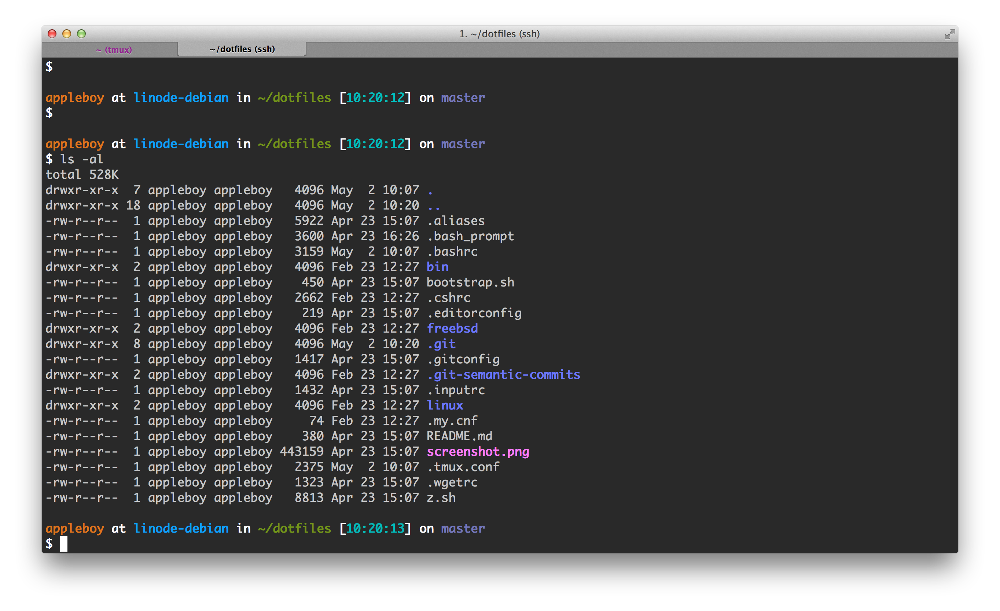
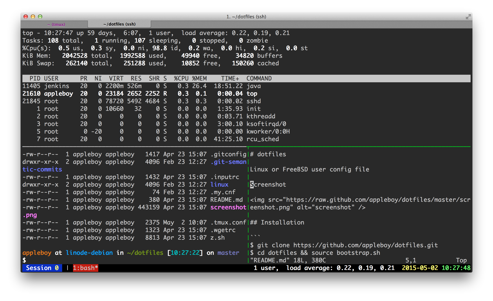

# dotfiles

Linux or FreeBSD user config file

Screenshot for bash



Screenshot for tmux



## Installation

```
$ git clone https://github.com/appleboy/dotfiles.git
$ cd dotfiles && source bootstrap.sh
```

Install [spf13-vim](https://github.com/spf13/spf13-vim)

```
$ sh <(curl https://j.mp/spf13-vim3 -L)
```

## Demo

Run demo using docker.

```
$ docker build -t demo ./Docker/
```

Login to docker terminal

```
$ docker run -t -i demo /bin/bash
```

# Author

Bo-Yi Wu, Twitter: [@appleboy](http://twitter.com/appleboy "Twitter"), Blog: http://blog.wu-boy.com
